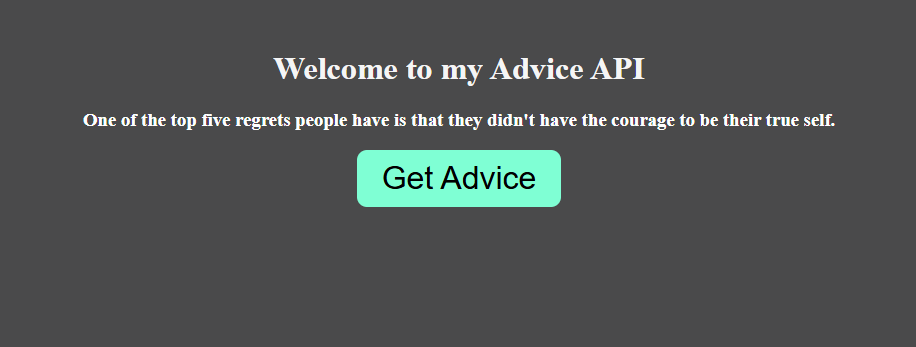

# 🧠 Advice API App

This is a simple React application that fetches random advice from the [Advice Slip API](https://api.adviceslip.com/) and displays it on the screen. It's a great beginner-friendly project to practice asynchronous API calls, error handling, and UI state management in React.

## 🚀 Features

- 🔁 Fetches random advice from the Advice Slip API
- 🔘 "Get Advice" button to trigger a new request
- 🔃 Loading state with "Please wait..." feedback
- ⚠️ Graceful error handling with user-friendly messages

## 🖼️ Demo UI



## 🛠️ Tech Stack

- React (Vite or CRA)
- JavaScript (ES6+)
- CSS

## 📦 Installation

```bash
git clone https://github.com/your-username/advice-api-app.git
cd advice-api-app
npm install
npm run dev  # or npm start if using CRA
```
🧩 Code Structure
App.js — Main component with state management and async API call

App.css — Basic styling

README.md — Project documentation

🧪 API Reference
Endpoint: https://api.adviceslip.com/advice

Response format:
```json
{
  "slip": {
    "id": 123,
    "advice": "Always believe in yourself."
  }
}
```
📌 Notes
The app disables the button while fetching to prevent multiple requests.

It displays an error message if the API call fails.

🧑‍💻 Author
Built with 💙 by Carlos

Enjoy collecting advice! 


